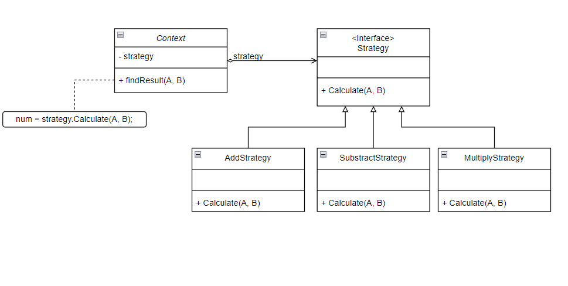
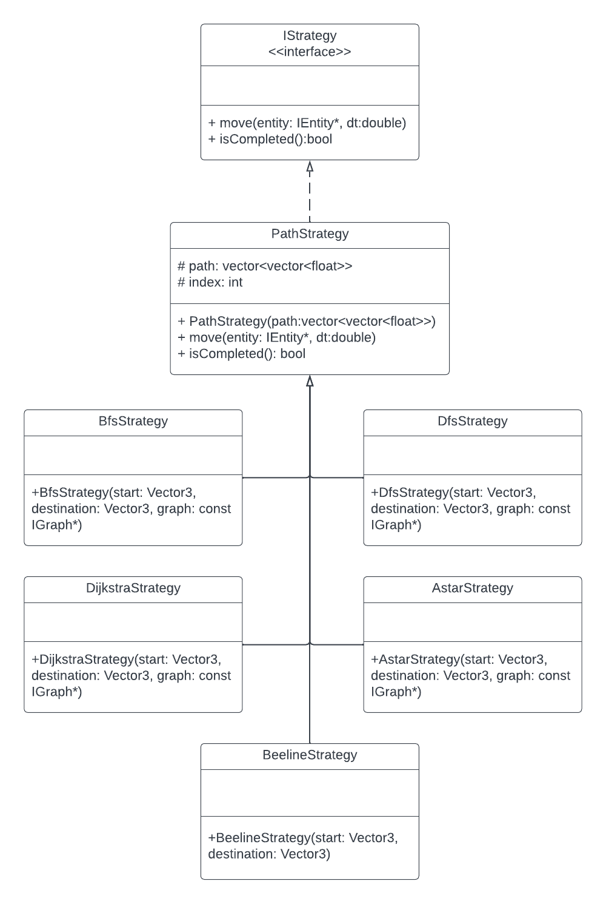

# 3081 Lab 8: Strategy Design Pattern
_(Due: Thursday, November 2nd, 2023 @ 11:59pm)_

## General Information

### Accessing a Lab Machine
For this assignment, we suggest you use a lab machine in ***Keller Hall 1-250*** or ***Keller Hall 1-262*** ([details](https://cse.umn.edu/cseit/classrooms-labs#cselabs)), as Git is already installed on these machines. You can also access a lab machine remotely using [SSH](https://github.umn.edu/umn-csci-3081-f23/FAQ/blob/main/SSH/README.md) or a web-based service called [VOLE](https://github.umn.edu/umn-csci-3081-f23/FAQ/blob/main/VOLE/README.md). You will use your CSE Labs account to login to the lab machines. If you do not already have an account, create the account following these [instructions](https://wwws.cs.umn.edu/account-management).

**IMPORTANT: One of the reasons you might not be able to log into a lab machine is that you reached your CSE Labs Account disk quota. To free space, please use these [instructions](https://github.umn.edu/umn-csci-3081-f23/FAQ/blob/main/CSE%20Disk%20Quota%20Exceeds/README.md). (In some cases, you might need to SSH into a CSE classroom or lab machine to complete the instructions.)**

## Retrieve Class Materials
1.  Clone your teams **private lab08** repository<br>
    *Note: **replace** Team-XXX-X with your lecture section and team number* <br>
    *Example: Team-001-1-lab08*
    ```bash
    git clone git@github.umn.edu:umn-csci-3081-f23/Team-XXX-X-lab08.git
    ```


### What's in lab08 folder?

<ul>
  <li>  <code>README.md</code>
  <li>  <code>.gitignore</code>
  <li>  <code>app</code> folder, which contains:
    <ul>
      <li>  <code>graph_viewer</code> : producing graph visualization
      <li>  <code>transit_service</code> : visualization
    </ul>
  <li>  <code>libs</code> folder, which contains:
    <ul>
      <li>  <code>routing</code> : finding the paths
      <li>  <code>transit</code> : entities properties
    </ul>
  <li> <code>docs</code>: Doxygen documentation files
  <li> <code>dependencies</code>
</ul>

## Lab Instructions

### Goal

  **The primary goal of this lab is for you to implement the movement of the entities and the uses of strategy design pattern that you learn during the lecture into actual code.**

## Tasks
| ID | Title | Task Summary Description | Task Deliverable |
| :---: | --- | --- | --- |
| Task 1 | Strategy Design Pattern | Implement the strategy design pattern of the movement into the source code | Source Code |
| Task 2 | Drone Movement | Make the drone move from its position to the destination | Source Code |
| Task 3 | Package Movement | Make the package move from its position to the destination | Source Code |
| Task 4 | Doxygen | Create documentation of the classes/functions that you create | HTML/Source Code |
| Task 5 | Code Styling | Match your code style with Google style guidelines | Source Code |

## Demo
You can view the demo of the final result [here](https://youtu.be/eED_tA3z1Ko).

## Steps to complete the lab

Implementation instructions later. Make sure you read these tasks before starting the implementation of features!

### Task 1 (Drone Movement)

1. Currently the package will not move towards the robot even after the delivery has been scheduled. Inside the Drone update function, you will notice that if the drone is available, then it will get the next delivery. However, afterward, it will do nothing.
2. Implement the movement of the drone if there is a delivery/package available.
3. Moving means updating the position of the entity in every frame by very small scale towards the direction that you want to move to. In our case, it would be to the packages's position (which is already set as drone's destination if the package is found, `libs/transit/src/drone.cc:21`).
4. In order to move, you would need to know the `direction` and `speed`. In our case, we already know the speed (when the drone was created), but not the direction. So first find the direction.
    ```c++
    direction = (destination_position - current_position).Unit();
    ```
5.  To update the position, we would add the `direction * speed` vector into the current position. To scale the simulation movement speed of the drone to be more realistic, we need to scale the movement vector by the difference in time (`dt`).
    ```c++
      my_position = my_position + (direction * speed * dt)
    ```

### Task 2 (Package  Movement)
1. Once the drone reaches the package, the destination of the drone will now be the destination of the package. Think of this like delivery instructions for the package, except you get to pick how the driver gets to the destination.
   - Think: how will you know the drone has reached the nearest package?
2. Now, every time the drone moves, the package has to move as well since the drone has picked up the package. (Example: if a person is riding a car, the car does the moving and the passenger is just sitting in it)
3. After both drone and package have arrived to their final destination, the package should be handed off to the robot owner, and the drone's availability should now again be free so that it can go to next package if applicable.

### Task 3 (Strategy design pattern concept)

The strategy pattern defines a family of algorithms, encapsulates each one, and makes them interchangeable. Strategy lets the algorithm vary independently from clients that use it. 

<p align="center"> </p>

A great example of the strategy pattern is a standard calculator. In this analogy the concrete classes would consist of addition, subtraction, multiplication, and division. The strategy would be an interface named operation. In this context, you could have a vector of numbers called operands and a vector of operator class pointers to calculate the inputted algorithm. 

More information on the strategy pattern can be found here: https://refactoring.guru/design-patterns/strategy

## Your implementation starts here

**Do not start implementing until you've read all the tasks listed in [this section](#steps-to-complete-the-lab)**

### Overview 

<p align="center"> </p>
(Click the picture above to view full picture with good resolution)

There will be **five** types of movement strategies we will be implementing the strategy pattern around in this lab. Beeline, DFS, BFS, Astar, and Dijkstra.

Our program will allow user to choose from **four** different movement strategies: DFS, BFS, Astar, and Dijkstra. Beeline will be used by drone to move towards the package. These four search algorithms while separate, do however take in the same parameters: Position, Destination, and the route graph (A representation of the graph can be seen by selecting the "Show All Routes" radio button on the simulation page). 

- **Beeline** will move from one point to another in linear movement direction. ([Task 1](#task-1-drone-movement) implements this function)<br>
- **Astar** will use Astar path finding algorithm to move from current position point to the destination position.<br>
- **Dijkstra** will uses Dijkstra path finding algorithm to move from current position point to the destination position.<br>
- **DFS** will use DFS path finding algorithm to move from current position point to the destination position.<br>
- **BFS** will use BFS path finding algorithm to move from current position point to the destination position.<br>

*Note*: You do not need to implement these routing algorithms, we have already provided the routing algorithms for you. All you need to do is to call and use them with strategy design pattern.

See the files below for Routing Algorithms
```bash
<repo_dir>/libs/routing/include/routing/
```

### Implementation:
1. Now you will be implementing the **Strategy Design pattern** that is shown above. The functions and variable do not need to be the exact same, this is just one way to implement. But the UML graph relation of your solution must be the same.


2. Create the `IStrategy`, `PathStrategy`, `DfsStrategy`, `BfsStrategy`, `AstarStrategy`, and `DijkstraStrategy` classes so that these classes will be used to move the entities. You will be creating your `BeelineStrategy` in a later step, so don't worry about that now.<br>
    **Important: The following does not have to be the exact same, this is just one way to implement**
    - Methods
        - `Constructor(startPos, endPos, graph)`: Other than BeelineStrategy, it should calculate the path (by using routing algorithms) to follow to move towards the destination.
          - [Getting a path](#getting-a-path)
        - `move(entity, dt): void`: Move the entity towards the next **node**/position.
          - [Task 1 notes](#task-1-drone-movement)
          - [Move() extra notes](#method-move)
        - `isCompleted(): bool`: Check if the position/node has arrived to *final* destination position/node.

3. PathStrategy will use the path that is provided by the graph to move around. <br>
**Important: Before implementing this `move()` method, try to understand what/how does the path work. Read [this](#method-move) section for more information**

4. Create your `BeelineStrategy` from the `PathStrategy`. ***Note**, because you're just doing a straight line from the starting location to the end location, the map/graph is not necessary. Maybe the `PathStrategy` constructor might be of use when setting up your strategy...*

5. Add code inside the Drone class so that when the next delivery package is available, it will use beeline strategy, pick up the package, then use that package's provided strategy name to move toward the final destination. The strategy name that can be found in package's strategy name are as follow:
    - astar
    - dfs
    - bfs
    - dijkstra

    **Note**: The drone will move toward the package using the beeline pattern and will pick up the package and move toward the package's destination using the pattern that user has defined during the schedule stage.

6. Once the drone and package reach their respective final destinations, the drone's availability status must be updated to free. Additionally, the reference to the package of the drone should no longer be set as the current package, allowing the drone to efficiently pick up the next package if necessary.

**Hint**: *Use the UML diagram provided for strategy design pattern to get started.*

After you complete implementing the strategy design pattern, your drone and package should be able to move using the Astar, BFS, DFS, and Dijkstra algorithm.

### Method: move()
[Task 1](#task-1-drone-movement) goes over the simple way to move between two points, but in this complex graph of paths to explore using search algorithms, we are not just moving between two set points. The algorithms (A*, BFS, DFS, Dijkstra), once they found their solution, return a vector of positions that the drone needs to move to, to navigate to their final destination.
```c++
  vector<vector<float>> path = SearchAlgorithm(start,end,map);
```
**Note: This is not correct code, yet rather to exemplify a point about the structure of path.**

So what does this mean for us? Well in a simple strategy like talked about with Beeline, we can just interpolate between the starting and ending location, yet with a path through the map that we need to take, **we should keep track of what _node_ or brief section of the map we are moving between**.

### Getting a path

For the search algorithms, we don't need a new instance of a search algorithm every time we want to compute a path. Because of this, each algorithm in `libs/routing/include/routing/<algorithm>.h` has a static default instance of that algorithm we can use to get our path. Here is some sample code that is _close but incomplete_.

```c++
path = mapGraph->getPath(startLocation, endDestination, SearchAlgorithm::Default())
```

### Task 4 (Doxygen)
Write Doxygen for all the **NEW** classes you create (public members only). Which in our case for this lab, are as follows:
- IStrategy.h
- AstarStrategy.h/.cc
- BeelineStrategy.h/.cc
- BfsStrategy.h/.cc
- DfsStrategy.h/.cc
- DijkstraStrategy.h/.cc
- PathStrategy.h/.cc

### Task 5 (Code Style)
Match your new code's style with Google Code Styling guide. Which in our case for this lab, is as follow:
- IStrategy.h
- AstarStrategy.h/.cc
- BeelineStrategy.h/.cc
- BfsStrategy.h/.cc
- DfsStrategy.h/.cc
- DijkstraStrategy.h/.cc
- PathStrategy.h/.cc
- Drone.h/.cc

## Final Submission

To submit your assignment, post on the Gradescope assignment "Lab 8: Strategy Design Pattern" your team repo link and the final commit ID for your submission.
Click [here](https://github.umn.edu/umn-csci-3081-f23/FAQ/blob/main/Commit%20ID/README.md) to see how to get commit id.
